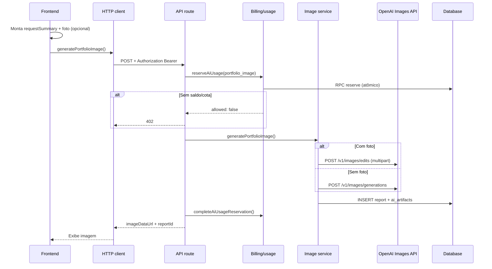

# Geração de imagem com OpenAI (portfólio pedagógico) — Guia de implementação

Atualizado em: 2026-06-08

Este documento descreve **como o APPROF implementa geração de imagem de portfólio pedagógico** usando a API de imagens da OpenAI (`gpt-image-1`, `gpt-image-2`, etc.). Foi escrito para ser reutilizado em outros projetos: outra IA ou equipe pode seguir o mesmo padrão arquitetural para fazer a funcionalidade funcionar de forma confiável em produção.

> **Importante:** não é ChatGPT de texto gerando imagem. O fluxo usa os endpoints dedicados da OpenAI:
> - `POST https://api.openai.com/v1/images/generations` — imagem do zero
> - `POST https://api.openai.com/v1/images/edits` — imagem com foto de referência (multipart)

---

## Princípios que fazem funcionar

1. **Chave da OpenAI só no backend** — o cliente nunca vê `OPENAI_API_KEY`.
2. **Reservar crédito/cota antes de gerar** — evita gerar sem saldo; estorna se falhar.
3. **Dois pipelines de prompt** — com foto (edit) vs. sem foto (generation).
4. **Redimensionar foto no cliente** — reduz payload, timeout e falhas na API.
5. **Timeouts alinhados** — cliente, rota HTTP e chamada OpenAI (~5 min para portfólio).
6. **Fallback de modelos** — se o modelo principal falhar, tenta alternativas.
7. **Persistir imediatamente** — cada geração vira um registro auditável com artefato (imagem + metadados).
8. **Rollback em erro** — apaga artefato parcial e estorna reserva de uso.

---

## Arquitetura em camadas

```
┌─────────────────────────────────────────────────────────────────┐
│  Frontend (PWA / app cliente)                                   │
│  - Coleta contexto (anotações, foto, formato)                   │
│  - Redimensiona foto (opcional)                               │
│  - POST /api/ai/generate-portfolio-image + Bearer JWT           │
└────────────────────────────┬────────────────────────────────────┘
                             │
┌────────────────────────────▼────────────────────────────────────┐
│  Backend API (Next.js / Node)                                   │
│  1. Autenticar usuário (JWT Supabase)                           │
│  2. reserveAiUsage(generationType: portfolio_image)             │
│  3. generatePortfolioImage() → OpenAI                           │
│  4. Persistir report + ai_artifacts                             │
│  5. completeAiUsageReservation() ou refund em caso de erro      │
└────────────────────────────┬────────────────────────────────────┘
                             │
        ┌────────────────────┼────────────────────┐
        ▼                    ▼                    ▼
   OpenAI Images      Supabase (reports)   Supabase (usage RPC)
```

### Diagrama de sequência



---

## Mapa de arquivos no APPROF

| Camada | Arquivo | Responsabilidade |
|--------|---------|------------------|
| UI | `apps/professora/src/subscreens/Report.tsx` | Escolha portfólio imagem, monta `requestSummary`, redimensiona foto, chama serviço |
| UI (histórico) | `apps/professora/src/subscreens/GeneratedDocuments.tsx` | Lista documentos `portfolio_image` |
| UI (correção) | `apps/professora/src/subscreens/DocumentDetail.tsx` | Regenera imagem com instrução da usuária |
| Cliente HTTP | `apps/professora/src/services/ai-usage.ts` | `generateAiPortfolioImage()` — fetch autenticado ao admin |
| API | `apps/admin/app/api/ai/generate-portfolio-image/route.ts` | Orquestra reserva → geração → cobrança → rollback |
| Serviço imagem | `apps/admin/app/lib/ai-image.ts` | Prompts, OpenAI, persistência |
| Uso/cobrança | `apps/admin/app/lib/ai-usage.ts` | Preço, reserva, finalização, estorno, cotas |
| Env | `apps/admin/.env.example` | `OPENAI_API_KEY`, modelo, tamanho, qualidade, custos |
| DB | `supabase/migrations/0013_reports_ai_artifacts.sql` | Coluna `ai_artifacts jsonb` em `reports` |
| DB | `supabase/migrations/0006_ai_usage_and_giztokens.sql` | Enum `portfolio_image`, RPC de reserva |

---

## Fluxo detalhado — passo a passo

### 1. Frontend: decisão do tipo de geração

Quando a professora escolhe **Portfólio pedagógico → Portfólio em imagem**:

- `portfolioOutput = 'image'` → `generationType = 'portfolio_image'`
- `portfolioImageFormat`: `portrait` | `landscape` | `square`

Função de mapeamento (simplificada):

```typescript
function getReportGenerationType(reportKind: string, portfolioOutput: 'text' | 'image') {
  if (reportKind === 'Portfólio pedagógico' || reportKind === 'Portfólio') {
    return portfolioOutput === 'image' ? 'portfolio_image' : 'portfolio_text'
  }
  // ... outros tipos
}
```

### 2. Frontend: montagem do `requestSummary`

Objeto enviado ao backend com todo o contexto pedagógico:

```typescript
const requestSummary = {
  reportKind: 'Portfólio pedagógico',
  portfolioOutput: 'image',
  portfolioImageFormat: 'portrait', // ou landscape | square
  studentName: 'Maria Silva',
  className: 'Maternal II',
  selectedAnnotations: [{ date, label, text }],
  selectedMilestones: [{ date, label, text }],
  extraContext: 'Instrução opcional da professora',
  blankContext: 'Texto quando começa do zero',
  attachments: [{ name, type, size, hasImageInPortfolio, extractedText }],
  // ... outros campos do formulário
}
```

### 3. Frontend: foto opcional + redimensionamento

Se houver imagem nos anexos, usa a primeira como `primaryPhotoDataUrl`:

```typescript
const rawPhotoDataUrl = attachments.find((item) => item.isImage && item.dataUrl)?.dataUrl ?? null
const primaryPhotoDataUrl = rawPhotoDataUrl
  ? await resizeImageForPortfolio(rawPhotoDataUrl)
  : null
```

`resizeImageForPortfolio` (no browser):

- Máximo **1024px** no maior lado
- Exporta **JPEG 85%**
- Em erro, devolve o original

Isso evita payloads enormes no POST e timeouts na API de edição.

### 4. Cliente HTTP: chamada autenticada

```typescript
export async function generateAiPortfolioImage(input: {
  generationType: 'portfolio_image'
  classId?: string | null
  studentId?: string | null
  promptVersion?: string
  requestSummary?: Record<string, unknown>
  primaryPhotoDataUrl?: string | null
}) {
  const apiBaseUrl = process.env.VITE_APPROF_ADMIN_API_URL // ou equivalente
  const token = await getSessionAccessToken() // JWT Supabase

  const controller = new AbortController()
  const timeout = setTimeout(() => controller.abort(), 300_000) // 5 min

  const response = await fetch(`${apiBaseUrl}/api/ai/generate-portfolio-image`, {
    method: 'POST',
    headers: {
      Authorization: `Bearer ${token}`,
      'Content-Type': 'application/json',
    },
    body: JSON.stringify(input),
    signal: controller.signal,
  })

  // 402 = sem cota/saldo (não tratar como erro 500)
  // allowed: true exige imageDataUrl
}
```

**Variável obrigatória no frontend:** `VITE_APPROF_ADMIN_API_URL` (URL do backend).

### 5. API route: orquestração transacional

Pseudocódigo da rota `POST /api/ai/generate-portfolio-image`:

```typescript
export const maxDuration = 300 // segundos (Vercel/serverless)

export async function POST(request: Request) {
  let logId: string | undefined
  let reservationCompleted = false
  let generatedReportId: string | undefined

  try {
    const ownerId = await getAuthenticatedUserId(request.headers.get('authorization'))
    const body = await request.json()

    // 1. Reservar uso ANTES de chamar OpenAI
    const reservation = await reserveAiUsage({
      ownerId,
      generationType: 'portfolio_image',
      classId: body.classId,
      studentId: body.studentId,
      promptVersion: body.promptVersion ?? 'portfolio-image-v1',
      requestSummary: body.requestSummary ?? {},
    })

    if (!reservation.allowed || !reservation.logId) {
      return NextResponse.json(reservation, { status: 402 })
    }

    logId = reservation.logId

    // 2. Gerar imagem
    const generated = await generatePortfolioImage({
      ownerId,
      generationType: 'portfolio_image',
      classId: body.classId,
      studentId: body.studentId,
      promptVersion: body.promptVersion ?? 'portfolio-image-v1',
      requestSummary: body.requestSummary ?? {},
      logId: reservation.logId,
      inputImageDataUrl: body.primaryPhotoDataUrl?.startsWith('data:image/')
        ? body.primaryPhotoDataUrl
        : null,
    })

    generatedReportId = generated.reportId

    // 3. Finalizar cobrança com custo real
    await completeAiUsageReservation({
      logId: reservation.logId,
      actualCostCents: generated.actualCostCents,
      resultSummary: { reportId: generated.reportId, model: generated.model, ... },
    })
    reservationCompleted = true

    return NextResponse.json({
      allowed: true,
      imageDataUrl: generated.imageDataUrl,
      reportId: generated.reportId,
      prompt: generated.prompt,
      model: generated.model,
      wallet: reservation.wallet,
      entitlement: reservation.entitlement,
    })
  } catch (error) {
    // Rollback: apagar report parcial + estornar reserva
    if (logId && !reservationCompleted) {
      if (generatedReportId) await rollbackGeneratedArtifacts({ reportId: generatedReportId, ownerId })
      await refundAiUsageReservation({ logId, reason: error.message })
    }
    // Retornar 400 (erro de validação) ou 500 (interno)
  }
}
```

**CORS:** habilitar `Authorization` e `Content-Type` para o domínio do app cliente.

### 6. Serviço de imagem: escolha generation vs. edit

```typescript
export async function generatePortfolioImage(input) {
  const summary = input.requestSummary ?? {}
  const model = process.env.OPENAI_IMAGE_MODEL || 'gpt-image-1'
  const size = resolvePortfolioImageSize(summary)   // portrait/landscape/square
  const quality = resolvePortfolioImageQuality()    // low | medium | high

  const prompt = input.inputImageDataUrl
    ? buildPortfolioImageEditPrompt(summary, size)
    : buildPortfolioImagePrompt(summary, size)

  const generated = input.inputImageDataUrl
    ? await requestOpenAiImageEdit({ model, inputImageDataUrl, prompt, size, quality, timeoutMs: 270_000 })
    : await requestOpenAiImage({ model, fallbackModels, prompt, size, quality, timeoutMs: 270_000 })

  const reportId = await persistGeneratedReport(input, {
    reportType: 'portfolio_image',
    artifactKind: 'portfolio_image',
    body: buildPersistedImageBody({ prompt, model, size, quality }),
    imageDataUrl: generated.image,
    artifact: { prompt, model, size, quality },
  })

  await persistUsage(reportId, input.ownerId, 'openai', generated.model, tokens, costCents)

  return { imageDataUrl: generated.image, reportId, prompt, model, size, quality, actualCostCents }
}
```

### 7. Mapeamento de formato → tamanho OpenAI

| `portfolioImageFormat` (UI) | Tamanho OpenAI |
|----------------------------|----------------|
| `portrait` | `1024x1536` |
| `landscape` | `1536x1024` |
| `square` | `1024x1024` |

Fallback: variável de ambiente `OPENAI_IMAGE_SIZE` (padrão `1024x1536`).

### 8. Chamada OpenAI — geração pura (`/images/generations`)

```typescript
await fetch('https://api.openai.com/v1/images/generations', {
  method: 'POST',
  headers: {
    Authorization: `Bearer ${OPENAI_API_KEY}`,
    'Content-Type': 'application/json',
  },
  body: JSON.stringify({
    model: 'gpt-image-2',
    prompt: '...',
    n: 1,
    size: '1024x1536',
    quality: 'high',
    background: 'opaque',
    moderation: 'low',
    output_format: 'png',
    user: ownerId, // ID do usuário para abuse tracking
  }),
})
```

Resposta: `data[0].b64_json` ou `data[0].url` → montar `data:image/png;base64,...`.

**Fallback:** tentar modelos em sequência (`gpt-image-2` → `gpt-image-1-mini` → `gpt-image-1`) se o erro for recuperável.

### 9. Chamada OpenAI — edição com foto (`/images/edits`)

Quando há `primaryPhotoDataUrl`:

1. Decodificar base64 do data URL
2. Montar `FormData` multipart:
   - `model`
   - `image[]` (blob da foto)
   - `prompt`
   - `n`, `size`, `quality`, `output_format`, `user`
3. `POST https://api.openai.com/v1/images/edits`
4. Até **2 tentativas** com delay de 3s em erros 429/5xx

O prompt de edição instrui layout (foto real preservada + blocos pedagógicos) e é **diferente** do prompt de geração pura.

### 10. Regras de prompt (negócio pedagógico)

Ambos os prompts incluem:

- Usar **apenas evidências** fornecidas pela professora
- **Não inventar** fatos sobre a criança
- Texto em **português brasileiro**
- Estilo educação infantil, tons pastel
- Sem diagnóstico, ranking, outras crianças identificáveis
- Sem marcas d'água ou QR code

Prompt de **edição** adicional:

- A foto da criança é **real** — não redesenhar, não substituir
- Layout por orientação (retrato/paisagem/quadrado) com posição da foto definida

`extraContext` da professora vira **instrução obrigatória** no prompt.

### 11. Persistência no banco

Tabela `reports` (exemplo):

```sql
INSERT INTO reports (
  owner_id,
  student_id,
  class_id,
  status,
  report_type,        -- 'portfolio_image'
  prompt_version,     -- 'portfolio-image-v1'
  body,               -- metadados + prompt em texto
  ai_artifacts        -- jsonb
) VALUES (...);
```

Estrutura de `ai_artifacts`:

```json
{
  "kind": "portfolio_image",
  "imageDataUrl": "data:image/png;base64,...",
  "prompt": "...",
  "model": "gpt-image-2",
  "size": "1024x1536",
  "quality": "high"
}
```

Tabela `reports_usage`: tokens e `cost_cents` para auditoria.

Migration: `supabase/migrations/0013_reports_ai_artifacts.sql`.

### 12. Cobrança e cotas (GizTokens)

`portfolio_image` no `ai-usage.ts`:

- **2 imagens incluídas por mês** (entitlement)
- Ciclo mensal (não anual como relatórios de desenvolvimento)
- Estimativa de custo: `OPENAI_IMAGE_ESTIMATED_COST_CENTS` (ex.: 80)
- Reserva atômica via RPC `reserve_ai_usage_atomic`
- Ordem: entitlement mensal → carteira GizTokens → bloqueio (402)

Em falha após reserva: `refund_ai_usage_reservation` com motivo.

---

## Variáveis de ambiente

### Backend (obrigatórias)

```env
OPENAI_API_KEY=sk-...
OPENAI_IMAGE_MODEL=gpt-image-2
OPENAI_IMAGE_SIZE=1024x1536
OPENAI_IMAGE_QUALITY=high
OPENAI_IMAGE_ESTIMATED_COST_CENTS=80
OPENAI_IMAGE_COST_CENTS=120
OPENAI_IMAGE_INPUT_COST_PER_MILLION_USD=8
OPENAI_IMAGE_OUTPUT_COST_PER_MILLION_USD=30
OPENAI_IMAGE_FALLBACK_MODEL=gpt-image-1-mini   # opcional
NEXT_PUBLIC_PROFESSORA_APP_URL=https://app.exemplo.com  # CORS
```

### Frontend

```env
VITE_APPROF_ADMIN_API_URL=https://admin.exemplo.com
```

---

## Resposta da API (sucesso)

```json
{
  "allowed": true,
  "message": "Imagem gerada com sucesso.",
  "chargeSource": "semester_entitlement",
  "imageDataUrl": "data:image/png;base64,...",
  "reportId": "uuid-do-report",
  "prompt": "...",
  "quality": "high",
  "provider": "openai",
  "model": "gpt-image-2",
  "wallet": { "giztokensRemaining": 450 },
  "entitlement": { "usedQuantity": 1, "includedQuantity": 2 }
}
```

## Resposta sem saldo (402)

```json
{
  "allowed": false,
  "message": "Mensagem amigável sobre cota ou GizTokens"
}
```

---

## Regeneração / correção de imagem

Em `DocumentDetail.tsx`, a usuária pode pedir ajustes (mín. 20 caracteres):

```typescript
await generateAiPortfolioImage({
  generationType: 'portfolio_image',
  classId: document.class_id,
  studentId: document.student_id,
  promptVersion: 'portfolio-image-correction-v1',
  requestSummary: {
    studentName,
    className,
    extraContext: promptDaCorrecao,
    blankContext: promptDaCorrecao,
  },
  // Sem primaryPhotoDataUrl → geração pura com novo prompt
})
```

Cada correção gera um **novo** `report` no histórico (não sobrescreve silenciosamente).

---

## Checklist para replicar em outro projeto

Use este checklist ao implementar geração de imagem em um projeto novo:

- [ ] Backend com rota dedicada (não misturar com texto GPT)
- [ ] `OPENAI_API_KEY` apenas no servidor
- [ ] Autenticação do usuário antes de qualquer chamada OpenAI
- [ ] Reserva de crédito/cota **antes** da geração
- [ ] `complete` após sucesso; `refund` + rollback após falha
- [ ] Dois modos: `generations` (sem foto) e `edits` (com foto multipart)
- [ ] Prompts versionados (`portfolio-image-v1`, `portfolio-image-correction-v1`)
- [ ] Redimensionar imagem de entrada no cliente (max ~1024px)
- [ ] Timeout cliente ≥ timeout rota ≥ timeout OpenAI (~270–300s)
- [ ] Fallback de modelos na geração pura
- [ ] Retry na edição para 429/5xx
- [ ] Persistir imagem + metadados (não confiar só na resposta HTTP)
- [ ] CORS com `Authorization` para o domínio do app
- [ ] Tratar HTTP 402 separado de 500
- [ ] Validar `data:image/` no `primaryPhotoDataUrl` no servidor
- [ ] Mensagens de erro amigáveis (`PublicAiGenerationError`)

---

## Diferença: portfólio imagem vs. portfólio texto vs. imagem avulsa

| Tipo | Endpoint APPROF | Provedor | Uso |
|------|-----------------|----------|-----|
| `portfolio_text` | `/api/ai/generate-text` | Claude/GPT texto | Narrativa pedagógica |
| `portfolio_image` | `/api/ai/generate-portfolio-image` | OpenAI Images | Capa/painel visual do portfólio |
| `generated_image` | `/api/ai/generate-image` | OpenAI Images (modelo menor) | Imagem avulsa por descrição livre |

Não reutilizar a rota de texto para imagem. São pipelines, prompts e precificação diferentes.

---

## Erros comuns e como evitar

| Problema | Causa | Solução no APPROF |
|----------|-------|-------------------|
| Timeout no cliente | Imagem demora > 60s default | AbortController com 300s |
| Payload too large | Foto original 5MB+ | `resizeImageForPortfolio` no browser |
| Cobrou sem gerar | OpenAI falhou após reserva | `refundAiUsageReservation` no catch |
| Report órfão | Falha após insert | `rollbackGeneratedArtifacts` |
| CORS bloqueado | Admin sem header | `OPTIONS` + `Access-Control-Allow-Origin` |
| Chave exposta | Chamada direta do browser | Tudo via backend |
| Imagem sem foto da criança quando esperada | Anexo não marcado como imagem | Validar `isImage && dataUrl` nos anexos |
| Modelo indisponível | Conta/região sem gpt-image-2 | `fallbackModels` em cadeia |

---

## Referência rápida — contrato HTTP

**Request:**

```http
POST /api/ai/generate-portfolio-image
Authorization: Bearer <supabase_access_token>
Content-Type: application/json

{
  "generationType": "portfolio_image",
  "classId": "uuid-opcional",
  "studentId": "uuid-opcional",
  "promptVersion": "portfolio-image-v1",
  "primaryPhotoDataUrl": "data:image/jpeg;base64,...",
  "requestSummary": {
    "studentName": "João",
    "className": "Maternal I",
    "portfolioImageFormat": "portrait",
    "selectedAnnotations": [{ "date": "2026-05-01", "label": "Linguagem", "text": "..." }],
    "extraContext": "Colocar foto à esquerda"
  }
}
```

**Response 200:** ver seção "Resposta da API (sucesso)".

---

## Para outra IA implementar do zero

Ao receber este documento, a outra IA deve:

1. Criar **serviço de imagem** no backend com `generatePortfolioImage`, prompts e chamadas OpenAI.
2. Criar **rota HTTP** que faz reserva → geração → complete/refund.
3. Criar **cliente no frontend** que envia JWT + contexto + foto opcional.
4. Criar **tabela/coluna** para persistir `ai_artifacts` com a imagem.
5. Implementar **controle de uso** (mesmo que simplificado: contador mensal por usuário).
6. Configurar **env vars** listadas acima.
7. Testar os dois caminhos: **com foto** (edits) e **sem foto** (generations).
8. Testar falha OpenAI e confirmar que **não cobra** nem deixa lixo no banco.

O padrão é intencionalmente **transacional e auditável** — priorize isso sobre "chamar OpenAI direto do React".

---

## Documentos relacionados no APPROF

- `docs/arquitetura-ia.md` — visão geral de IA (texto + princípios)
- `docs/registro-de-desenvolvimento.md` — contexto pedagógico dos relatórios
